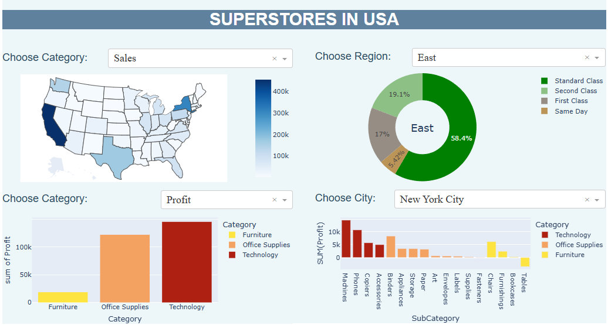

# Superstore Sales Data Analysis 

This project analyzes and visualizes sales data from superstores in the United States. The data is retrieved from a Kaggle dataset and processed to create an interactive dashboard for exploring various sales metrics.

## Prerequisites

To automatically download the zip file of the dataset, you will need:

  - A Kaggle account, sign up on [Kaggle](https://www.kaggle.com/).
  - Go to your Kaggle account and create your API token.
  - Download the kaggle.json file which contains your authentication token.
  - Upload the kaggle.json file to the Colab runtime before running the notebook. This is necessary to download the dataset from Kaggle.

## Requirements

The code was written in a Jupyter Notebook on Google Colab and uses the following libraries:

- pandas for data manipulation
- dash for creating the interactive dashboard
- plotly.express for data visualization
- matplotlib and seaborn for additional visualizations
- plotly.graph_objects and plotly.subplots for creating advanced plots
- jupyter_dash for running Dash within Jupyter
- pandasql for SQL-like querying of pandas DataFrames
- 'kaggle.json', your personal API token downloaded from kaggle for authentication

